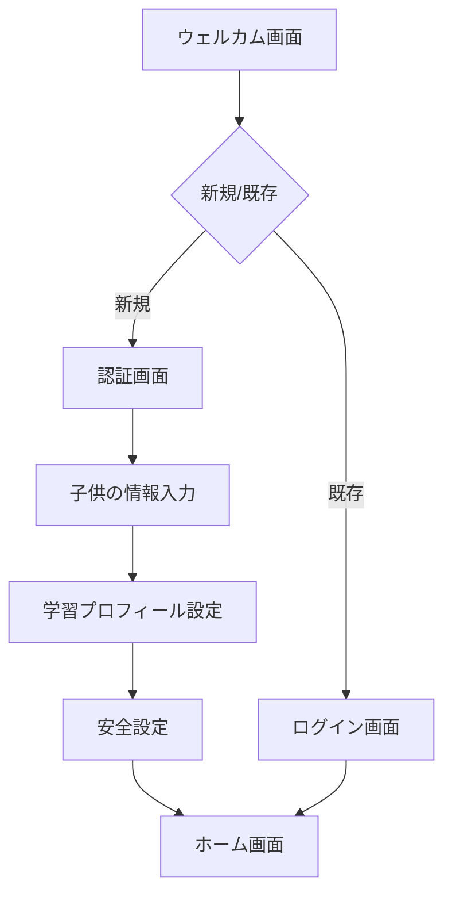

# 子供向けパーソナライズAIエージェント UI仕様書

## 1. 概要

本ドキュメントは、iOS向け子供用パーソナライズAIエージェントアプリケーションのUI仕様を定義します。
本アプリケーションは、SwiftUIを使用して実装され、音声対話を主なインターフェースとし、
保護者による初期設定と子供による日常的な利用の2つの主要なユースケースをサポートします。

---

## 2. デザインシステム

### 2.1 カラーパレット

```swift
extension Color {
    static let primary = Color("Primary")      // メインカラー（明るい青系）
    static let secondary = Color("Secondary")  // アクセントカラー（ビビッドな黄色系）
    static let background = Color("Background") // 背景色（白系）
    static let text = Color("Text")           // テキスト色（濃紺系）
    static let error = Color("Error")         // エラー表示（赤系）
    static let success = Color("Success")     // 成功表示（緑系）
}
```

### 2.2 タイポグラフィ

```swift
extension Font {
    static let heading1 = Font.system(size: 28, weight: .bold)
    static let heading2 = Font.system(size: 24, weight: .semibold)
    static let heading3 = Font.system(size: 20, weight: .medium)
    static let body = Font.system(size: 16, weight: .regular)
    static let caption = Font.system(size: 14, weight: .regular)
    static let button = Font.system(size: 18, weight: .medium)
}
```

### 2.3 共通コンポーネント

#### ボタン
- プライマリーボタン：塗りつぶし、角丸、アニメーション効果
- セカンダリーボタン：アウトライン、角丸
- テキストボタン：下線なし、タップ時ハイライト

#### テキスト入力
- テキストフィールド：アウトライン付き、プレースホルダーテキスト
- 数値入力フィールド：キーボードタイプ = 数値
- 日付選択：DatePicker使用

#### その他
- アラート：システム標準アラート
- トースト：一時的な通知表示
- ローディング：アクティビティインジケータ

---

## 3. 画面仕様

### 3.1 初期設定フロー（保護者用）

#### 3.1.1 ウェルカム画面
- アプリロゴ
- ウェルカムメッセージ
- [開始する]ボタン
- [既存ユーザーログイン]ボタン

#### 3.1.2 認証画面
- Apple Sign Inボタン
- または
- PINコード入力フィールド（6桁）
- [次へ]ボタン

#### 3.1.3 子供の情報入力画面
```swift
struct ChildInfoView {
    @State private var name: String
    @State private var birthDate: Date
    @State private var gender: Gender
    @State private var schoolGrade: SchoolGrade
    
    // 必須入力項目の表示
    var requiredFields: some View
    // オプション項目の表示（趣味など）
    var optionalFields: some View
    // 次へボタン（すべての必須項目が入力された場合のみ有効）
    var nextButton: some View
}
```

#### 3.1.4 学習プロフィール設定画面
```swift
struct LearningProfileView {
    // 得意科目選択（複数選択可）
    @State private var strongSubjects: Set<Subject>
    // 苦手科目選択（複数選択可）
    @State private var weakSubjects: Set<Subject>
    // 興味・関心事項（フリーテキスト）
    @State private var interests: String
    
    var subjectSelectionGrid: some View
    var interestsInput: some View
    var nextButton: some View
}
```

#### 3.1.5 安全設定画面
```swift
struct SafetySettingsView {
    // フィルタリング設定
    @State private var contentFilterEnabled: Bool
    // 利用可能時間帯
    @State private var availableTimeStart: Date
    @State private var availableTimeEnd: Date
    // 1日の最大利用時間
    @State private var maxDailyUsage: TimeInterval
    
    var filterToggle: some View
    var timeRangePicker: some View
    var usageLimitPicker: some View
    var completeButton: some View
}
```

### 3.2 メイン画面（子供用）

#### 3.2.1 ホーム画面
```swift
struct HomeView {
    // エージェントの表示領域（アニメーション可能）
    var agentView: some View
    // 音声入力ボタン
    var voiceInputButton: some View
    // 音声認識状態表示
    var recognitionStateView: some View
    // 会話履歴表示
    var conversationHistoryView: some View
}
```

#### 3.2.2 音声対話インターフェース
```swift
struct VoiceInteractionView {
    // 音声認識状態
    @State private var isListening: Bool
    // 音声認識結果
    @State private var recognizedText: String
    // エージェント応答
    @State private var agentResponse: String
    
    // マイクボタン（アニメーション付き）
    var microphoneButton: some View
    // 音声波形表示
    var waveformView: some View
    // テキスト表示領域
    var textDisplayArea: some View
}
```

---

## 4. 画面遷移図



---

## 5. アクセシビリティ要件

### 5.1 VoiceOver対応
- すべてのUIコンポーネントに適切なラベルを設定
- 画像には代替テキストを提供
- 操作の順序を論理的に設定

### 5.2 ダイナミックタイプ対応
- テキストサイズの動的変更に対応
- レイアウトの自動調整

### 5.3 コントラスト
- テキストと背景のコントラスト比は4.5:1以上
- 重要な情報は7:1以上

---

## 6. エラーハンドリング

### 6.1 入力エラー
- 必須項目の未入力：赤枠表示とエラーメッセージ
- 形式誤り：インラインでエラー表示
- 修正方法のガイダンス表示

### 6.2 システムエラー
- ネットワークエラー：再試行ボタン付きアラート
- 音声認識エラー：視覚的フィードバックとリトライ提案
- クラッシュ防止：適切なfallback UI

---

## 7. アニメーションとトランジション

### 7.1 画面遷移
- push/pop: スライドアニメーション
- modal: フェードインアニメーション

### 7.2 状態変更
- ボタン押下時の視覚的フィードバック
- ローディング状態の表示
- エラー/成功時のアニメーション

### 7.3 音声対話
- 音声入力中の波形アニメーション
- エージェントの感情表現アニメーション
- テキスト表示のタイピングアニメーション

---

## 8. レスポンシブデザイン

### 8.1 デバイス対応
- iPhone SE (4.7インチ) から iPhone Pro Max まで対応
- iPad 対応（Split View考慮）
- 画面回転対応

### 8.2 レイアウト調整
- Safe Area 考慮
- Dynamic Island 対応
- キーボード表示時の自動スクロール

---

## 9. プロトタイピング

### 9.1 必要なプロトタイプ
1. 初期設定フロー
2. 音声対話インターフェース
3. エラー状態
4. アニメーションとトランジション

### 9.2 プロトタイプツール
- Figma / Sketch での画面デザイン
- SwiftUI Previews でのインタラクション確認
- TestFlight でのベータテスト

---

## 10. 実装ガイドライン

### 10.1 SwiftUI実装規約
- ViewModifierの活用
- カスタムコンポーネントの再利用
- PreviewProvider の実装

### 10.2 アセット管理
- アセットカタログの使用
- ベクター画像の優先使用
- 適切な命名規則

### 10.3 ローカライゼーション
- 文字列リソースの外部化
- 右から左書きの言語対応
- 複数言語対応の考慮